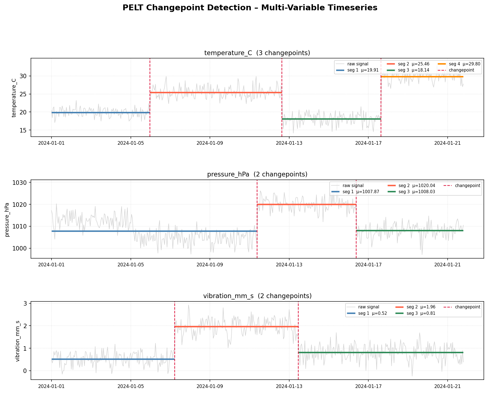

# Signal Segmentation with PELT

Detect regime changes in multi-variable timeseries using the **PELT** (Pruned Exact Linear Time) algorithm — an exact changepoint detection method that runs in O(n) average time.

---

## What it does

Given a CSV with several sensor-like variables over time, the notebook:

1. Loads the data with **pandas**
2. Runs **PELT** independently on each variable (via the `ruptures` library)
3. Plots the raw signals, per-segment means, and detected changepoints



---

## Project structure

```
signal_segmentation/
├── generate_data.py          # Generate synthetic timeseries CSV
├── timeseries_data.csv       # 500-row, 3-variable dataset (auto-generated)
├── signal_segmentation.ipynb # Main notebook: PELT detection + visualisation
├── pelt_segmentation.png     # Output figure (auto-generated by notebook)
├── pyproject.toml            # Project dependencies
└── uv.lock                   # Locked dependency versions
```

---

## Requirements

- Python 3.12+
- [uv](https://github.com/astral-sh/uv) (recommended) — or any Python package manager

Dependencies (declared in `pyproject.toml`):

| Package      | Purpose                          |
|--------------|----------------------------------|
| `pandas`     | Load and manipulate CSV data     |
| `numpy`      | Numerical operations             |
| `matplotlib` | Plotting                         |
| `ruptures`   | PELT changepoint detection       |
| `scipy`      | Signal processing utilities      |

---

## Getting started

### 1. Clone the repo

```bash
git clone <repo-url>
cd signal_segmentation
```

### 2. Install dependencies

```bash
uv sync
```

### 3. Generate the dataset

```bash
uv run python generate_data.py
```

This creates `timeseries_data.csv` with 500 hourly samples across three variables, each containing planted regime shifts at known positions.

| Variable         | Unit   | Planted changepoints (sample index) |
|------------------|--------|--------------------------------------|
| `temperature_C`  | °C     | 120, 280, 400                        |
| `pressure_hPa`   | hPa    | 100, 250, 370                        |
| `vibration_mm_s` | mm/s   | 150, 300                             |

### 4. Run the notebook

Open `signal_segmentation.ipynb` in VS Code (or JupyterLab) and run all cells.

```bash
# JupyterLab alternative
uv run jupyter lab signal_segmentation.ipynb
```

The notebook will:
- Print detected changepoint indices for each variable
- Display and save the segmentation plot as `pelt_segmentation.png`

---

## How PELT works

PELT minimises a penalised cost function over all possible segmentations:

```
minimise  Σ cost(segment) + pen × (number of changepoints)
```

- **Higher penalty** → fewer changepoints detected
- **Lower penalty** → more changepoints detected
- The `rbf` cost model detects shifts in both **mean** and **variance**

The penalty is tuned per variable in the notebook to account for differing noise levels.

---

## Adapting to your own data

1. Replace `timeseries_data.csv` with your own file (keep a `timestamp` column + numeric variables).
2. Adjust `penalty_map` in the notebook — start high and lower until the detected changepoints match your expectations.
3. Swap `model="rbf"` for `"l2"` (mean-only) or `"l1"` (robust to outliers) if needed.
