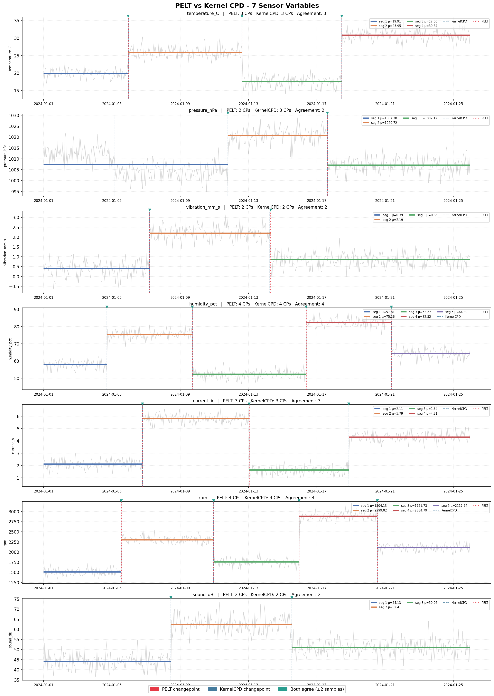

# Signal Segmentation – PELT vs Kernel CPD

Detect regime changes in multi-variable timeseries by comparing two exact changepoint detection algorithms from the **ruptures** library:

| Algorithm | Class | Sensitivity | Complexity |
|-----------|-------|-------------|------------|
| **PELT** – Pruned Exact Linear Time | `rpt.Pelt` | Mean & variance shifts | O(n) avg |
| **KernelCPD** – Kernel Change Point Detection | `rpt.KernelCPD` | Full distribution shifts (via RKHS) | O(n²) worst |



---

## Dataset

7 synthetic sensor variables, 600 hourly samples each, with planted regime shifts:

| Variable | Unit | Planted changepoints (sample index) |
|---|---|---|
| `temperature_C` | °C | 120, 280, 420 |
| `pressure_hPa` | hPa | 100, 260, 400 |
| `vibration_mm_s` | mm/s | 150, 320 *(+ sinusoidal component)* |
| `humidity_pct` | % | 90, 210, 370, 490 |
| `current_A` | A | 140, 290, 430 |
| `rpm` | RPM | 110, 240, 360, 470 |
| `sound_dB` | dB | 180, 350 |

---

## Project structure

```
signal_segmentation/
├── generate_data.py          # Generate the synthetic CSV dataset
├── timeseries_data.csv       # 600-row × 7-variable dataset (auto-generated)
├── signal_segmentation.ipynb # Main notebook: detection + comparison + visualisation
├── pelt_vs_kernel.png        # Output figure (auto-generated by notebook)
├── pyproject.toml            # Project dependencies
└── uv.lock                   # Locked dependency versions
```

---

## Requirements

- Python 3.12+
- [uv](https://github.com/astral-sh/uv) (recommended)

| Package | Purpose |
|---|---|
| `pandas` | Load and manipulate CSV data |
| `numpy` | Numerical operations |
| `matplotlib` | Plotting |
| `ruptures` | PELT and KernelCPD changepoint detection |
| `scipy` | Signal processing utilities |

---

## Getting started

### 1. Clone the repo

```bash
git clone <repo-url>
cd signal_segmentation
```

### 2. Install dependencies

```bash
uv sync
```

### 3. Generate the dataset

```bash
uv run python generate_data.py
```

### 4. Run the notebook

Open `signal_segmentation.ipynb` in VS Code (or JupyterLab) and run all cells.

```bash
# JupyterLab alternative
uv run jupyter lab signal_segmentation.ipynb
```

---

## Notebook walkthrough

| Cell | What it does |
|---|---|
| **1 – Load data** | Reads `timeseries_data.csv` with pandas, shows descriptive stats |
| **2 – Detection** | Runs PELT and KernelCPD on every variable, prints found changepoints and runtimes |
| **3 – Visualisation** | One subplot per variable — raw signal, PELT segment means, both sets of changepoints, agreement markers |
| **4 – Summary table** | Per-variable count of changepoints, penalties used, runtime in ms |

---

## How the algorithms work

### PELT
Minimises a penalised segmentation cost over the signal:

```
minimise  Σ cost(segment) + pen × (number of changepoints)
```

Uses an **inequality pruning** test to discard candidate changepoints that can never be optimal, giving O(n) average time.

### KernelCPD
Maps each sample into a **reproducing kernel Hilbert space (RKHS)** via an RBF kernel, then minimises the **maximum mean discrepancy (MMD)** between adjacent segments. Because it operates on the full kernel embedding rather than raw values, it can detect subtle distributional shifts that PELT may miss — at the cost of O(n²) worst-case complexity.

### Reading the plot

| Visual element | Meaning |
|---|---|
| Light grey line | Raw signal |
| Coloured horizontal bars | PELT segment means |
| Red dotted vertical | PELT changepoint |
| Blue dashed vertical | KernelCPD changepoint |
| Teal **▼** marker | Both methods agree (within ±2 samples) |

---

## Adapting to your own data

1. Replace `timeseries_data.csv` with your own file — keep a `timestamp` column and numeric sensor columns.
2. Adjust the `config` dict in cell 2: `{column: (pelt_penalty, kernel_penalty)}`.
   - Start high and lower until results match expectations.
   - Signals with periodic components need a higher KernelCPD penalty.
   - Signals with large absolute values (e.g. RPM) need a lower PELT penalty.
3. Swap `model="rbf"` / `kernel="rbf"` for `"l2"` (mean-only) or `"l1"` (robust to outliers) if needed.
